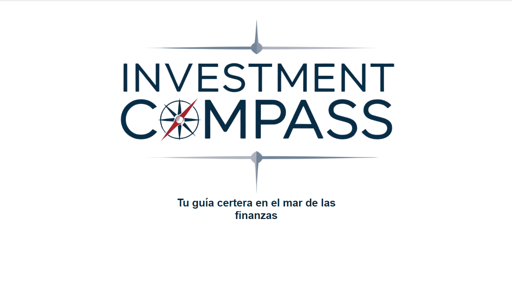
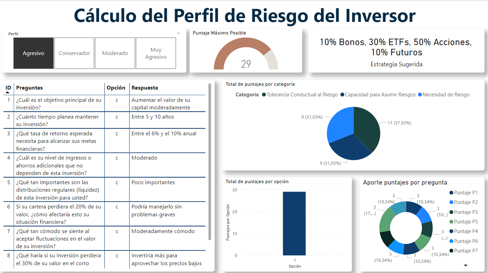
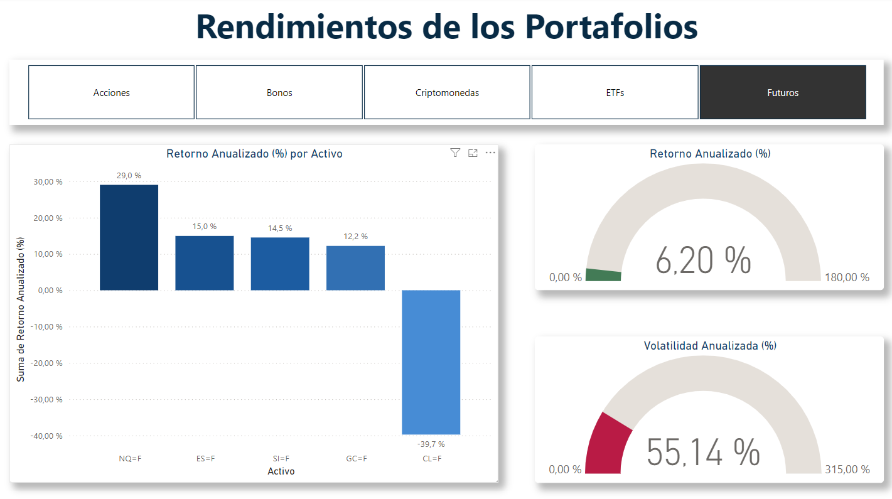
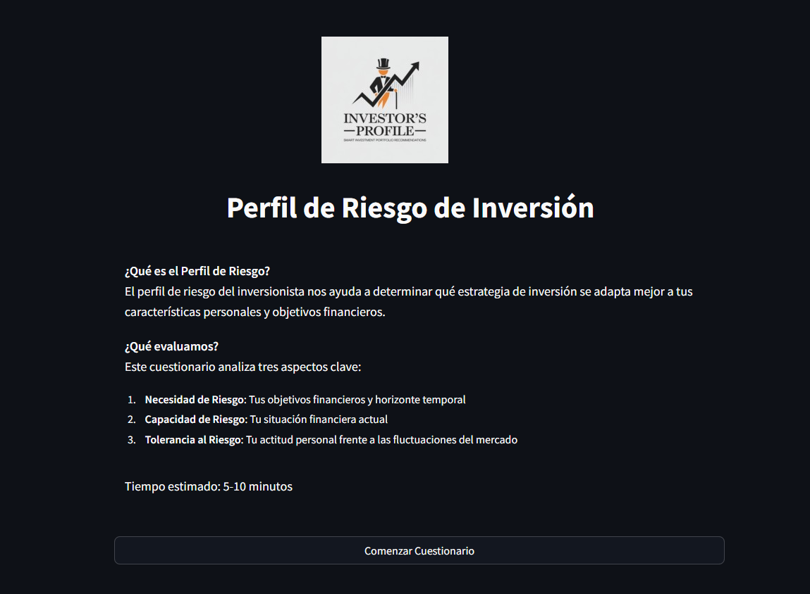
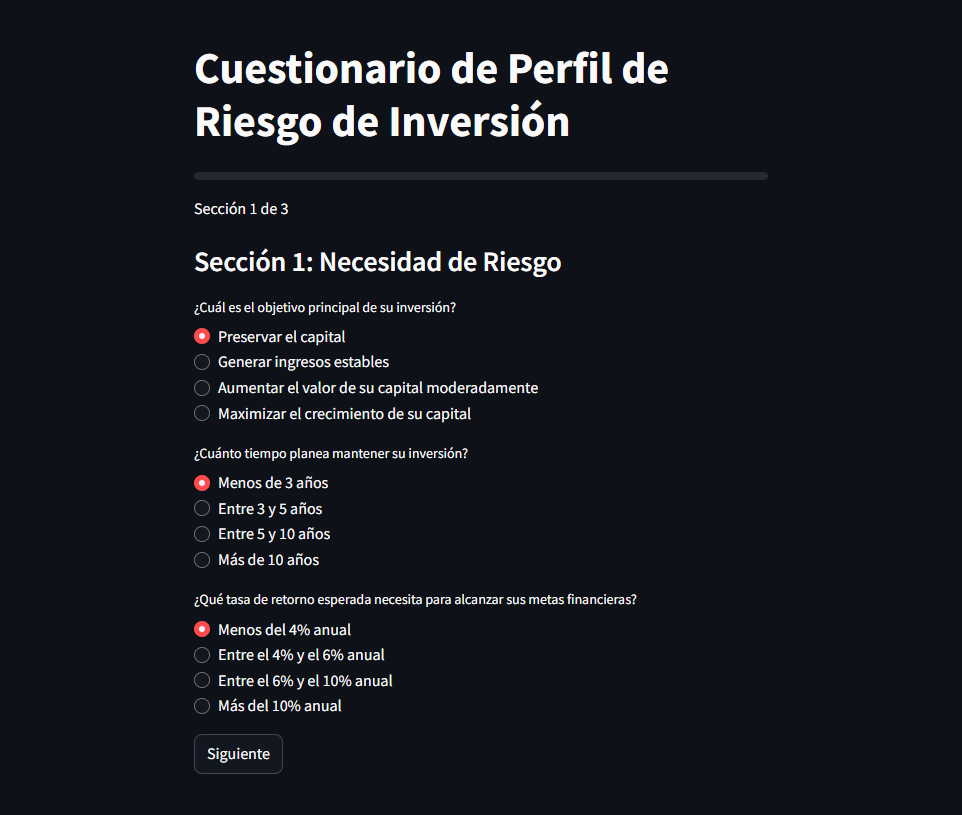
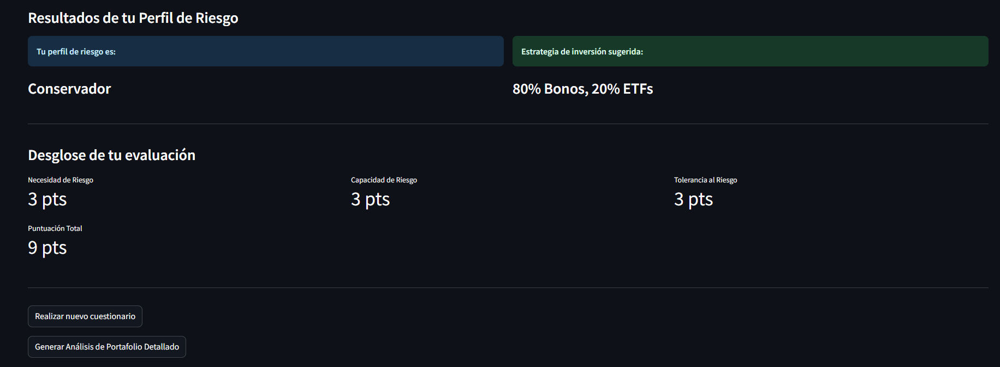
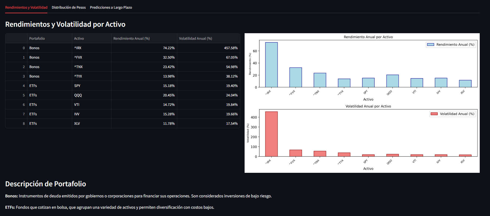
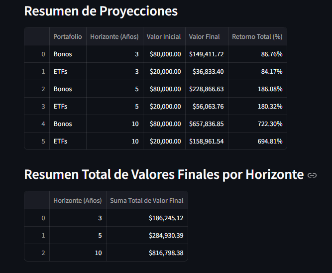

# C22-36-n-data-bi

# <h1 align= 'center'>Proyecto sobre Tendencias de Inversión- Smartreade</h1>

  

# Producto

- [Presentación del Producto]()
- [Documentación Completa del Desarrollo del Proyecto]()

# Índice

- [Introducción](#Introducción)
- [Objetivos](#Objetivos)
- [Datos](#Datos)
- [Desarrollo](#Desarrollo)
  - [ETL](#ETL)
  - [EDA](#EDA)
  - [Dashboard](#Dashboard)
  - [Modelo](#Modelo)
  - [Deploy](#Deploy)
- [Tecnologías](#Tecnologías)
- [Conclusiones](#Conclusiones)
- [Equipo](#Equipo)

# Introducción

Nuestro cliente el Banco de Inversión Latinoamericano (BILA) quiere resolver la falta de herramientas accesibles para que sus clientes puedan identificar su perfil de riesgo y tomar decisiones de inversión informadas y personalizadas. Actualmente, muchas personas tienen dificultades para entender cuánto riesgo están dispuestas a asumir y cómo podrían crecer sus inversiones bajo diferentes escenarios de mercado. Esto resulta en inversiones mal ajustadas al perfil de riesgo, baja satisfacción y resultados financieros inesperados.

# Objetivos

Desarrollar una solución que permita a los clientes de BILA recibir asesoría personalizada en sus inversiones, en función de su perfil de riesgo, optimizando el portafolio de inversión  y proporcionando proyecciones de rendimiento para aumentar la satisfacción, retención y fidelización de los clientes.

Para ello debemos proporcionar:

* Un marco de análisis el cual será conformado por un análisis de la
### **Objetivos Específicos**

- **1. Identificar y clasificar el perfil de riesgo de cada cliente** mediante un cuestionario que permita definir su tolerancia al riesgo y horizonte de inversión, categorizándolo en un perfil adecuado (conservador, moderado, agresivo).
- **2. Proporcionar recomendaciones personalizadas de distribución de activos** (bonos, ETFs, acciones, criptomonedas, etc) según el perfil de riesgo de cada cliente, optimizando la asignación de acuerdo con sus preferencias y objetivos financieros.
- **3. Desarrollar proyecciones de rendimiento en diferentes escenarios de mercado**  para que el cliente visualice el posible crecimiento de su inversión y tome decisiones informadas.

# Datos
El proyecto utiliza datos financieros históricos para analizar y optimizar portafolios de inversión. Estos datos son extraídos de fuentes confiables a través de la API de Yahoo Finance utilizando la librería yfinance.

### Fuente de Datos
* Proveedor: Yahoo Finance
* Contenido: Precios históricos de cierre para activos financieros como:
*   Acciones: Microsoft (MSFT), Apple (AAPL), Google (GOOGL), entre otros.
*   Bonos: Índices como ^IRX, ^FVX.
*   ETFs: SPY, QQQ, VTI, entre otros.
*   Futuros: Oro (GC=F), Petróleo (CL=F).
*   Criptomonedas: Bitcoin (BTC-USD), Ethereum (ETH-USD).
### Descripción del Dataset
Rango temporal:
Los datos abarcan desde el 9 de noviembre de 2017 hasta el 31 de octubre de 2024 (configurable).
### Variables principales:
* Close: Precio de cierre diario para cada activo.
* Fecha: Índice temporal de los precios.
# Desarrollo
## ETL
### Extracción de Datos
Utilizando la librería yfinance, se obtienen datos históricos de precios de cierre de una lista de activos financieros para un rango de fechas definido. Esto asegura que los datos sean precisos y estén actualizados.

* Método: download_data(assets: List[str])
* Entrada: Lista de activos financieros (por ejemplo, ["MSFT", "AAPL"]).
* Salida: DataFrame consolidado con precios de cierre para cada activo.
### Transformación de Datos
Los datos extraídos se transforman para mantener únicamente las columnas relevantes (por ejemplo, los precios de cierre). Se renombran las columnas con los nombres de los activos para facilitar su análisis posterior.

### Procesamiento de Portafolios
La función process_portfolios(portfolios: Dict[str, List[str]]) organiza los datos en portafolios categorizados por tipo de activo (acciones, bonos, ETFs, etc.).

* Entrada: Un diccionario donde las claves son los nombres de los portafolios (por ejemplo, "Bonos") y los valores son listas de activos correspondientes.
* Salida: Un diccionario donde cada clave contiene un DataFrame con los datos históricos de los activos de ese portafolio.
## EDA
## Dashboard
<table>
  <tr>
    <td >
      
    </td>
    <td >
      
    </td>
      <tr>
    <td >
      
    </td>
  </tr>

  </tr>
</table>

## Modelo
### Modelo: Random Forest Regressor
El modelo Random Forest Regressor es una técnica de ensamble basada en árboles de decisión que combina múltiples modelos débiles para mejorar la precisión y reducir el sobreajuste. Este modelo es particularmente adecuado para predicciones financieras, dado su capacidad para manejar relaciones no lineales y datos heterogéneos.

### Implementación:
Se inicializa el modelo con los siguientes parámetros:
  from sklearn.ensemble import RandomForestRegressor
  self.model = RandomForestRegressor(
      n_estimators=100,  # Número de árboles en el bosque
      random_state=42    # Semilla para reproducibilidad
  )

### Características del modelo:
* Número de estimadores (n_estimators): 100 árboles para garantizar un balance entre precisión y tiempo de entrenamiento.
* Estado aleatorio (random_state): Fijado para garantizar resultados reproducibles.
## Deploy

# Tecnologías
El proyecto utiliza las siguientes herramientas y librerías:

* Python para el desarrollo general.
* Streamlit para crear la interfaz interactiva.
* YFinance para obtener datos históricos de activos.
* Pandas y Numpy para manipulación y análisis de datos.
* Matplotlib y Seaborn para visualización de datos.
* Scikit-learn para predicciones basadas en modelos de machine learning.
# Resultados

  
   
     
       
          

# Equipo

<!-- Primera fila -->
<table>
  <tr>
    <td align="center">
       <strong>Manuel</strong> 
      
      
    </td>
    <td align="center">
       <strong>José</strong> 
      
      
    </td>
      <tr>
    <td align="center">
       <strong>Mario</strong> 
      
      
    </td>
  </tr>

  </tr>
</table>

